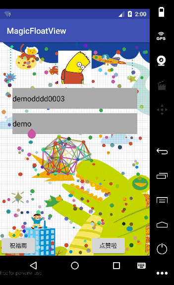

# MagicFloatView

一个可配置及自定义拓展漂浮路径的迷你版轻量级 MagicFlyLinearLayout 控件，支持多种配置效果，譬如自上而下飘落的表情彩蛋（类似 QQ 空间或者微信效果）、自下而上散乱的点赞心型漂浮（类似优酷直播点赞按钮效果），具体不同配置展示效果如下图。
Demo 中附带一个魔幻粒子链动画背景自定义 View，支持粒子链随手指触摸移动变换，具体效果如下图背景所示（手指触摸不同区域时，随机粒子链跟随魔幻移动）。

<div></div>

# 说明文档

如下是关于 MagicFlyLinearLayout View 的相关使用方式、属性说明、拓展自定义的解释说明。

### 使用样例

```xml
<cn.magic.library.MagicFlyLinearLayout
        android:id="@+id/fly_layout"
        app:flyAnimatorType="B2TScatter"
        app:flyDuration="4000"
        android:layout_width="200dp"
        android:layout_height="800dp"
        android:orientation="vertical"
        android:layout_alignParentRight="true"
        android:layout_alignParentBottom="true"
        android:gravity="bottom|center_horizontal">
        <Button
            android:id="@+id/fly_btn"
            android:text="点赞啦"
            android:layout_width="wrap_content"
            android:layout_height="wrap_content" />
    </cn.magic.library.MagicFlyLinearLayout>
```

```
mFlyLinearLayout = (MagicFlyLinearLayout) this.findViewById(R.id.fly_layout);
mFlyButton = (Button) this.findViewById(R.id.fly_btn);
mFlyButton.setOnClickListener(this);

mFlyLinearLayout.addDrawable(R.drawable.favourite_love_blue);
mFlyLinearLayout.addDrawable(R.drawable.favourite_love_pink);
mFlyLinearLayout.addDrawable(R.drawable.favourite_love_red);
mFlyLinearLayout.addDrawable(R.drawable.favourite_love_yellow);

//click button
mFlyLinearLayout.flying();
```

### 已实现类说明

| 类别 | 类名 | 说明 |
| ----- | ----- | ----- |
| library | MagicFlyLinearLayout | 魔幻漂浮控件，支持自上而下表情雨及自下而上点赞扩散效果，支持表情及扩散 bitmap 自定义，支持拓展定义漂浮路径效果。 |
| library | ValueState | 辅助 MagicFlyLinearLayout 动画效果使用的属性 Bean 结构，包含 bitmap、scale、alpha、position 等属性。 |
| library | AnimatorCreater | 一个类似工厂模式的创建类，负责依据 MagicFlyLinearLayout 的不同 app:flyAnimatorType 属性类型决定使用哪种 AbsAnimatorEvaluator 动画效果。|
| library | AbsAnimatorEvaluator | 一个抽象的漂浮动画类，供 MagicFlyLinearLayout 中元素的漂浮使用。|
| library | B2TScatterEvaluator | 自下而上点赞效果的动画路径实现类，类似直播软件或者优酷直播间点赞心型漂浮效果，如上图右下角点击效果。 |
| library | T2BRainEvaluator | 自上而下随机飘落的动画路径效果，类似微信关键字表情飘落彩蛋效果，如上图自上而下飘落的表情效果。 |
| demo | ParticleChainView | 一个粒子链跟随手指移动的魔幻效果，仅 Demo 版本。 |

### MagicFlyLinearLayout 控件属性说明

| 属性 | 含义 |
| ----- | ----- |
|app:flyDuration | 整数，单个漂浮元素在屏幕漂浮的事件（动画时长），默认 4000 ms。 |
|app:flyAnimatorType | 单个漂浮元素在屏幕漂浮的效果类型，当前支持 B2TScatter（点赞效果） 与 T2BRainNormal（表情漂浮雨效果） 类型，其他类型可自己继承 AbsAnimatorEvaluator 实现。 |

### 拓展 MagicFlyLinearLayout 的 app:flyAnimatorType 漂浮动画路径使用方式

1. 继承 AbsAnimatorEvaluator 实现相关方法（动画起始、终止坐标，动画路径及属性封装）。
2. 在 AnimatorCreater 中添加新实现动画路径类型，同时在 attrs 中 app:flyAnimatorType 属性添加对应新类型值字符串。
3. 使用 MagicFlyLinearLayout 方式同上，只是配置 app:flyAnimatorType 为你自己动效路径的类型即可。

# License 声明

MIT License

Copyright (c) 2016 yanbo

Permission is hereby granted, free of charge, to any person obtaining a copy
of this software and associated documentation files (the "Software"), to deal
in the Software without restriction, including without limitation the rights
to use, copy, modify, merge, publish, distribute, sublicense, and/or sell
copies of the Software, and to permit persons to whom the Software is
furnished to do so, subject to the following conditions:

The above copyright notice and this permission notice shall be included in all
copies or substantial portions of the Software.

THE SOFTWARE IS PROVIDED "AS IS", WITHOUT WARRANTY OF ANY KIND, EXPRESS OR
IMPLIED, INCLUDING BUT NOT LIMITED TO THE WARRANTIES OF MERCHANTABILITY,
FITNESS FOR A PARTICULAR PURPOSE AND NONINFRINGEMENT. IN NO EVENT SHALL THE
AUTHORS OR COPYRIGHT HOLDERS BE LIABLE FOR ANY CLAIM, DAMAGES OR OTHER
LIABILITY, WHETHER IN AN ACTION OF CONTRACT, TORT OR OTHERWISE, ARISING FROM,
OUT OF OR IN CONNECTION WITH THE SOFTWARE OR THE USE OR OTHER DEALINGS IN THE
SOFTWARE.